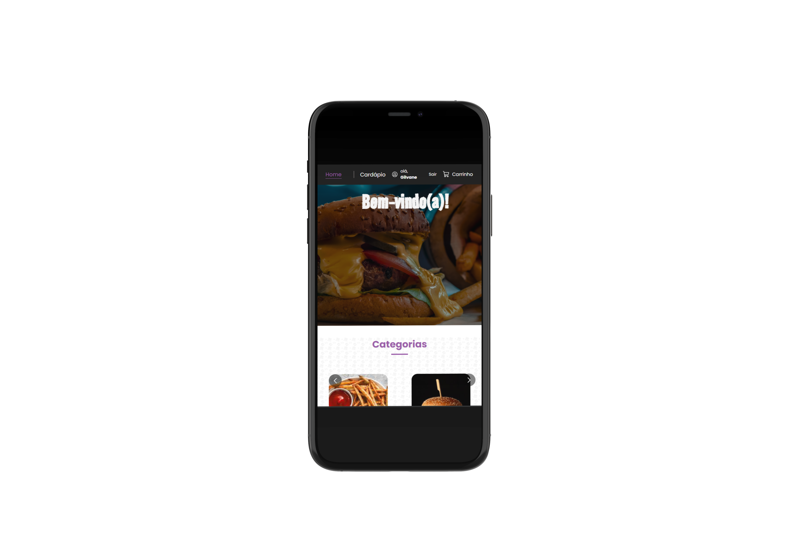

# DevBurguer Interface 🍔

Interface web desenvolvida para atuar como **camada cliente** do sistema **DevBurguer**, permitindo o gerenciamento de produtos, categorias e pedidos de uma hamburgueria digital através de uma **SPA moderna e responsiva**, integrada a uma API REST backend.

---

## 🎯 Visão Geral

O **DevBurguer Interface** foi criado para resolver a necessidade de uma **interface administrativa clara e eficiente**, capaz de consumir uma API backend e oferecer à equipe operacional controle total sobre o fluxo do negócio.

A aplicação se comunica diretamente com a **API DevBurguer**, sendo responsável apenas pela experiência do usuário e apresentação dos dados, respeitando a separação de responsabilidades entre frontend e backend.

---

## 📸 Demonstração da Interface

Exemplos visuais da aplicação em diferentes dispositivos, evidenciando o design responsivo.

### 📱 Versão Mobile
<p align="center">
  
</p>

### 💻 Versão Desktop
<p align="center">
  
</p>

---

## 🧩 Problema e Solução

Sistemas de gestão para restaurantes exigem uma **interface intuitiva**, que permita à equipe:

- Gerenciar o catálogo de produtos;
- Organizar categorias do menu;
- Acompanhar e atualizar pedidos;
- Operar o sistema com rapidez, inclusive em dispositivos móveis.

O **DevBurguer Interface** resolve essas necessidades ao fornecer uma **Single Page Application (SPA)** responsiva, focada em usabilidade, que consome uma API REST bem definida, garantindo fluidez na operação e separação clara entre frontend e backend.

---

## 👥 Público-Alvo

- Equipes administrativas de restaurantes e hamburguerias
- Desenvolvedores frontend consumindo APIs REST
- Avaliadores técnicos e recrutadores analisando aplicações React

---

## 🧠 Nível Técnico

**Intermediário**

O projeto demonstra domínio de:
- Arquitetura SPA
- Consumo de APIs REST
- Organização de aplicações React
- Padronização de código frontend

---

## 🛠 Tecnologias Utilizadas

- **React** — construção de interfaces reativas
- **Vite** — ambiente de desenvolvimento rápido
- **JavaScript (ES6+)**
- **ESLint** e **Prettier** — qualidade e padronização de código
- **Consumo de API REST** — integração com backend Node.js

---

## ✨ Funcionalidades Principais

- Listagem e gerenciamento de produtos;
- Gestão de categorias;
- Visualização e atualização de pedidos;
- Comunicação com API REST para operações CRUD;
- Interface responsiva para desktop e dispositivos móveis.

---

## ▶️ Como Executar o Projeto Localmente

### Pré-requisitos

- Node.js (>= 16.x)
- npm ou yarn

### Passos

```bash
git clone https://github.com/GilvaneAlves/DevBurguer-Interface.git
cd DevBurguer-Interface
npm install
# ou
yarn install
npm run dev
# ou
yarn dev
```

A aplicação estará disponível em:
```
http://localhost:5173
```

> ⚠️ **Observação:** é necessário que a **API DevBurguer** esteja em execução para que a interface funcione corretamente.

---

## 📁 Estrutura de Pastas (Resumo)

```text
devburguer-interface/
├── public/
├── src/
│   ├── assets/                 # Imagens, ícones e estáticos
│   ├── components/             # UI reutilizável (Button, CardProduct, Header, Footer, etc.)
│   │   ├── BackButton/
│   │   ├── Button/
│   │   ├── CardProduct/
│   │   ├── CartButton/
│   │   ├── CategoryCarousel/
│   │   ├── Footer/
│   │   ├── Header/
│   │   └── OffersCarousel/
│   ├── containers/             # Páginas/containers com lógica de tela (Home, Carrinho, etc.)
│   ├── hooks/                  # Contextos e hooks (UserContext, CartContext)
│   │   ├── UserContext.jsx
│   │   └── CartContext.jsx     # [Se existir]
│   ├── routes/                 # Rotas da aplicação (src/routes/index.jsx)
│   ├── services/               # Comunicação com API (src/services/api.js)
│   ├── styles/                 # Estilização e temas (src/styles/globalStyles.js)
│   ├── utils/                  # Helpers e utilitários
│   ├── App.jsx                 # Componente raiz
│   └── main.jsx                # Bootstrap React/Vite
├── index.html                  # Vite
├── package.json
├── eslint.config.js / .eslintrc
├── .prettierrc.js / .prettierrc
├── jsconfig.json               # ou tsconfig.json
└── README.md
```

---

## 🛣 Possíveis Melhorias Futuras (Roadmap)

- Testes automatizados (Jest / React Testing Library)
- Migração para TypeScript
- Autenticação e controle de sessão no frontend
- Documentação integrada com Swagger
- Internacionalização (i18n)

---

## 📄 Licença

MIT License
